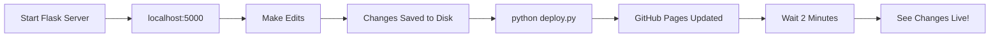

# Trail Blogger Editing Workflow

## 🎯 Design Philosophy

**Localhost = Edit & Save**  
**GitHub Pages = Read-Only Display**

This is the proper way to use static site hosting like GitHub Pages!

---

## 🔧 Where You Can Edit

### ✅ localhost:5000 (Full Editing)

**What you can do:**
- ✅ Add new trails
- ✅ Edit trail details (name, length, difficulty, dates, descriptions)
- ✅ Upload images
- ✅ Change trail status (hiked ↔ unhiked)
- ✅ Delete trails
- ✅ Manage data (backups, restore)
- ✅ All changes are SAVED to disk

**How to access:**
```bash
python server.py
```
Then visit: http://localhost:5000

---

### 👁️ GitHub Pages (Read-Only)

**What you can do:**
- ✅ View all trails
- ✅ See trail details, images, descriptions, dates
- ✅ Browse the map
- ✅ Filter by hiked/unhiked
- ✅ Share with others

**What you CANNOT do:**
- ❌ Add trails
- ❌ Edit trails
- ❌ Change trail status
- ❌ Upload images
- ❌ Delete trails

**Why?** GitHub Pages is a static file server - it has no database or backend to save changes.

**Live site:** https://realcaddish.github.io/trailBlogger/

---

## 📋 Your Workflow

### Making Changes



**Step-by-step:**

1. **Start Flask Server**
   ```bash
   python server.py
   ```

2. **Edit on localhost:5000**
   - Add new trails
   - Update existing trails
   - Change hiked/unhiked status
   - Add/edit descriptions and dates
   - Upload images
   
   **✅ All changes automatically save to `data/trails.geojson`**

3. **Deploy to GitHub Pages**
   ```bash
   python deploy.py
   ```
   
   This will:
   - Validate your data
   - Create a backup
   - Commit changes to git
   - Push to GitHub
   - GitHub Pages rebuilds automatically

4. **Wait 2 Minutes**
   - GitHub Pages takes ~2 minutes to rebuild
   - Then your changes are live!

5. **Verify**
   - Visit https://realcaddish.github.io/trailBlogger/
   - Check your changes are there

---

## 🗂️ Trail Status Management

### Changing Status (Hiked ↔ Unhiked)

**On localhost:5000:**

1. Click on a trail
2. Click "Edit"
3. Change the "Status" dropdown:
   - **Hiked** → Trail appears in "Hiked" filter
   - **Unhiked** → Trail appears in "Unhiked" filter
4. Click "Save"
5. Status is immediately updated and saved to disk

**Then deploy:**
```bash
python deploy.py
```

**Result:**
- Trails automatically sorted by status on GitHub Pages
- "Hiked" filter shows only hiked trails
- "Unhiked" filter shows only unhiked trails
- Status persists across deployments

---

## 🚫 What Happens If Someone Edits on GitHub Pages?

**Short answer: Nothing is saved.**

1. User makes changes in their browser
2. Changes are stored in browser memory only
3. User refreshes page → changes are lost
4. No changes are saved to the server
5. No one else sees the changes

**That's why we disabled editing on GitHub Pages!**

---

## 💾 Backup Strategy

### Automatic Backups

Every time you run `python deploy.py`, an automatic backup is created.

### Manual Backups

Before making major changes:

```bash
python complete_backup.py
```

This creates a timestamped backup in `backups/` with:
- `trails_backup.geojson` - All trail data
- `trail_images.zip` - All images
- `README.md` - Restore instructions

### Restoring from Backup

```bash
python complete_restore.py
```

This will:
1. List all available backups
2. Let you select one
3. Restore trails and images
4. Create safety backup of current data first

---

## 📊 Data Flow Diagram

```
┌─────────────────────────────────────────┐
│         localhost:5000                  │
│  (Flask Server with Editing)            │
│                                         │
│  [Edit Trails] [Change Status]          │
│  [Add Images] [Update Dates]            │
│                                         │
│            ↓ SAVES TO ↓                 │
│                                         │
│      data/trails.geojson                │
│      data/trail_images/                 │
└─────────────────────────────────────────┘
                  ↓
                  ↓ python deploy.py
                  ↓
┌─────────────────────────────────────────┐
│              GitHub                     │
│         (Git Repository)                │
│                                         │
│      data/trails.geojson                │
│      data/trail_images/                 │
└─────────────────────────────────────────┘
                  ↓
                  ↓ Auto-build (2 min)
                  ↓
┌─────────────────────────────────────────┐
│         GitHub Pages                    │
│   (Read-Only Static Site)               │
│                                         │
│  [View Trails] [Browse Map]             │
│  [Read Descriptions] [See Images]       │
│                                         │
│  ❌ NO EDITING ❌                        │
└─────────────────────────────────────────┘
```

---

## ⚡ Quick Reference

| Action | Where | Command |
|--------|-------|---------|
| Edit trails | localhost:5000 | `python server.py` |
| Create backup | Terminal | `python complete_backup.py` |
| Deploy to live | Terminal | `python deploy.py` |
| Verify deployment | Terminal | `python verify_deployment.py` |
| Restore backup | Terminal | `python complete_restore.py` |
| View live site | Browser | https://realcaddish.github.io/trailBlogger/ |

---

## 🎯 Benefits of This Workflow

✅ **Simple** - One source of truth (localhost)  
✅ **Safe** - GitHub Pages can't accidentally delete data  
✅ **Fast** - No complex sync needed  
✅ **Free** - GitHub Pages hosting is free  
✅ **Reliable** - Static sites almost never break  
✅ **Shareable** - Anyone can view your live site  

---

## ❓ FAQ

**Q: Can I add a trail directly on GitHub Pages?**  
A: No. You must add trails on localhost:5000, then deploy.

**Q: What if I change a trail status on the live site?**  
A: The change will be lost when you refresh the page. It's not saved.

**Q: How do I share my trails with others?**  
A: Just share the GitHub Pages URL: https://realcaddish.github.io/trailBlogger/

**Q: Do my friends need to run the Flask server?**  
A: No! They just visit your GitHub Pages site. Only YOU need Flask for editing.

**Q: What if I forget to deploy after editing?**  
A: Your changes are safe on your computer in `data/trails.geojson`, but they won't show on the live site until you run `python deploy.py`.

**Q: Can I edit on my phone?**  
A: Not easily. Flask runs on your computer. You'd need to edit files directly or use a cloud IDE.

---

## 🎉 Summary

**Your workflow is now:**

1. ✏️ **Edit** on localhost:5000 (Flask)
2. 💾 **Save** (automatic when you click "Save" in the UI)
3. 🚀 **Deploy** with `python deploy.py`
4. ⏱️ **Wait** 2 minutes
5. ✅ **Live** on GitHub Pages!

Simple, safe, and effective! 🎯

